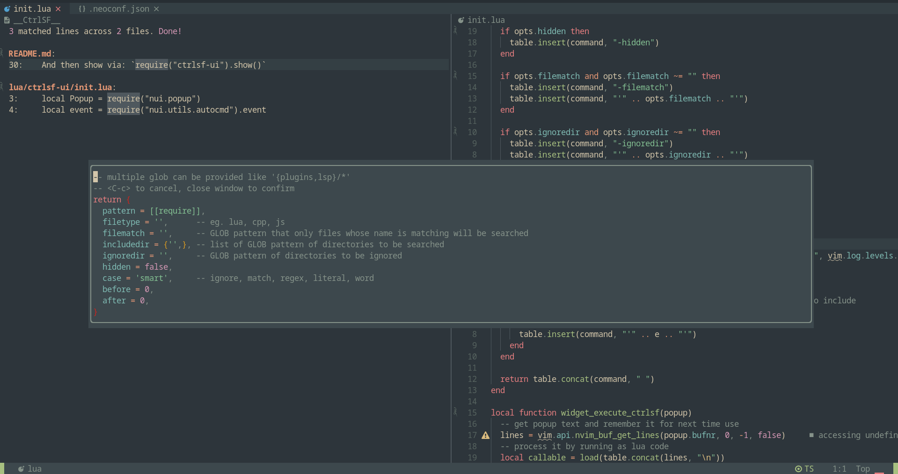

# ctrlsf-ui.nvim

Neovim UI for great search and replace plugin: CtrlSF



Configure using lazy.nvim (includes lazy loading):

```
  {
    "P4Cu/ctrlsf-ui.nvim",
    dependencies = {
      "MunifTanjim/nui.nvim",
      {
        "dyng/ctrlsf.vim",
        cmd = {
          "CtrlSF",
          "CtrlSFClearHL",
          "CtrlSFClose",
          "CtrlSFFocus",
          "CtrlSFOpen",
          "CtrlSFQuickfix",
          "CtrlSFStop",
          "CtrlSFToggle",
          "CtrlSFUpdate",
        },
      },
    },
  },
```

And then show via: `require("ctrlsf-ui").show()`
